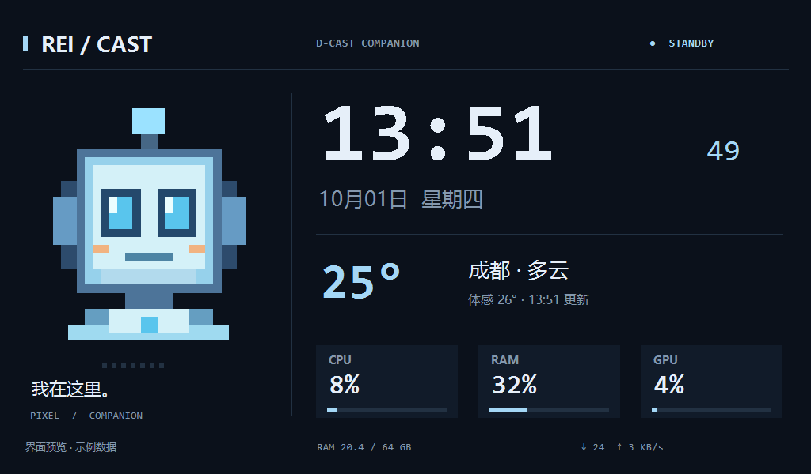
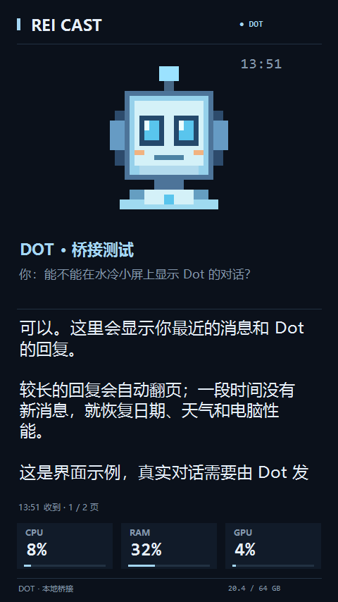
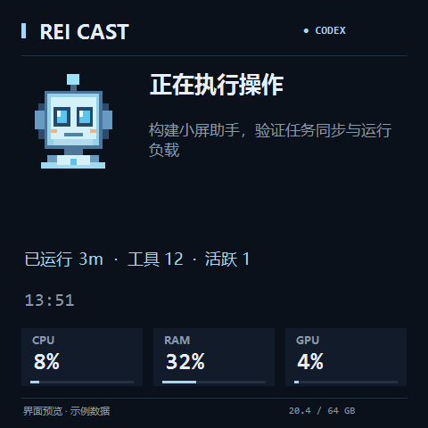

# Rei Cast — a D-Cast display companion

[简体中文](README.zh-CN.md) · [Compatibility](COMPATIBILITY.md) · [Extensions](EXTENSIONS.md) · [MIT license](LICENSE)

A lightweight Windows companion for **cooler displays exposed as a secondary monitor by DeepCreative's D-Cast mode**. Put your coding assistant's activity, the latest Dot reply, a clock, weather, and PC usage on the screen already inside your PC.

Rei Cast is designed around the Windows display interface rather than one cooler model or one resolution. Select any eligible secondary display; landscape, portrait, and square layouts adapt automatically, with uniform scaling that keeps the pixel avatar in proportion.



## What it does

- **Codex activity:** show observed local task phases, elapsed time, tool operations, and active tasks. Progress percentages are not fabricated.
- **Dot dialogue:** display the most recently published user message and visible reply, with automatic pagination and expiry. This is an opt-in local bridge, not an automatic cloud-chat subscription.
- **Standby:** show date, time, configurable weather, CPU/RAM/GPU usage, and network activity.
- **Display selection:** detect a single named D-Cast/DeepCool/JZFS display, retain the LT360 fallback, or select another secondary monitor by name and resolution. Multiple matching displays require an explicit choice. A saved monitor identity helps survive Windows display-number changes.
- **Login startup:** current-user startup plus a 30-second delayed task, bounded launch verification, one running instance, and local diagnostics.
- **Wake recovery:** react to unlock, display changes and resume with a finite redraw/rebuild sequence.
- **Customizable:** local JSON settings, replacement avatars, and bounded JSON snapshots for other tools.

The application is native C# / Windows Forms using .NET Framework. It has no bundled browser engine and the screen program makes no AI calls. A 20-second sample of v0.2.0 on the original 854×480 installation measured about 0.015% total-system CPU and 66 MB working set; this is a sample, not a limit or a guarantee. See [validation](VALIDATION.md).

## Compatibility

**Requirement:** D-Cast must already be enabled and the cooler screen must appear in Windows as an extended, non-primary display. DeepCreative provides the display transport; Rei Cast draws a normal Windows window on it.

The display layer accepts arbitrary secondary-monitor sizes, including portrait and square screens. Only LT360 VISION has been exercised on physical hardware so far. Other D-Cast models are supported by this interface design but need community hardware reports; see [the compatibility matrix](COMPATIBILITY.md).

Windows 10/11 x64 and .NET Framework 4.8 are the target environment. This is an independent community project. DeepCool and OpenAI do not sponsor or maintain it.

## Install

1. Enable D-Cast in [DeepCreative](https://downloads.deepcool.com/) and choose **Extend** in Windows display settings.
2. Download `rei-cast-windows-x64.zip` from [Releases](https://github.com/Cartmancxx/Rei-Cast/releases), extract it, and open PowerShell in the extracted `rei-cast` folder.
3. Install and start:

```powershell
powershell.exe -NoProfile -ExecutionPolicy Bypass -File .\scripts\install.ps1
```

The installer copies the app into `%USERPROFILE%\ReiCast\app`, preserves settings, enables current-user login startup, and starts the companion. Administrator access is not needed. This physical user-folder location avoids MSIX LocalAppData redirection that previously broke logon startup.

If the app waits in the tray, right-click **Rei Cast → Settings** and select the D-Cast monitor. The list includes its display name and resolution. A unique recognized D-Cast monitor is selected automatically; an unknown secondary monitor is not taken over automatically. The primary monitor is never a target.

For a portable preview, run `ReiCast.exe --preview`. To run on the selected cooler screen without installing startup, double-click the executable. To install without startup, use `scripts/install.ps1 -NoAutostart`.

## Configure

Settings live in `%USERPROFILE%\ReiCast\config.json` and reload within ten seconds. The tray settings dialog covers monitor selection, weather coordinates, brightness, seconds, task titles and GPU counters. Additional JSON options include:

| Setting | Default | Meaning |
| --- | --- | --- |
| `displayDevice` | `auto` | Automatic detection or an explicitly selected Windows display |
| `displayIdentity` | empty | Optional monitor interface identity saved by the settings dialog |
| `layout` | `auto` | `auto`, `landscape`, `portrait`, or `compact` |
| `avatarPath` | empty | Use bundled mascot, or an absolute path to your own image |
| `city`, `latitude`, `longitude` | Chengdu | Weather location; change all three together |
| `metricsSeconds` | `3` | Performance sampling, minimum 2 seconds |
| `taskSeconds` | `2` | Local status checks, minimum 2 seconds |
| `weatherMinutes` | `30` | Weather refresh, minimum 15 minutes |
| `enableDotDialogue` | `true` | Allow published Dot snapshots to appear |
| `dialoguePageSeconds` | `8` | Reply page interval, 5–30 seconds |

The clock refreshes at most once per second. Weather uses [Open-Meteo](https://open-meteo.com/) and sends the configured coordinates; task observation and dialogue snapshots are local. CPU/RAM/GPU figures are usage estimates, not cooler temperatures or pump telemetry.

## Publish Dot replies to the screen

Allow your Dot to access the connected computer and keep that computer online. Give it an ongoing instruction to use this plugin's `dot-display` skill to publish the actual visible reply and the latest user message. Local skill access requires a connected computer; see [OpenAI's Dot computer-access documentation](https://learn.chatgpt.com/docs/dots/computers-and-apps).

The producer accepts an input file:

```json
{
  "userMessage": "What's next?",
  "reply": "The build passed. I'm checking the display layout next.",
  "ttlSeconds": 300
}
```

```powershell
.\scripts\publish-dot.ps1 -InputFile C:\path\to\reply.json
```

The reply has priority while fresh, automatically pages, then returns to task/standby mode. The default expiry is five minutes. The bridge does not retrieve existing Dot cloud conversations or force Dot to call it on every turn; real per-turn publishing must be verified with your Dot. No new local polling agent or model is started. See [EXTENSIONS.md](EXTENSIONS.md) for limits and the atomic snapshot contract.

 

## Build and check

No NuGet, Node or Python dependency is required. Use the .NET Framework compiler supplied with Windows:

```powershell
.\scripts\build.ps1
.\scripts\verify.ps1
.\scripts\package.ps1
```

GitHub Actions performs the same build/check/package steps on Windows. The first push of a new version to `main`, or a version tag, publishes the ZIP and SHA-256 checksum. Assets of an existing release are preserved.

The source separates display selection/layout (`Screens.cs`), drawing (`Display.cs`), local Codex observation (`Core.cs`), metrics/weather (`Providers.cs`), Dot snapshots (`Dialogue.cs`) and bounded wake recovery (`Recovery.cs`).

## Troubleshooting and limits

- **No cooler display:** first check that D-Cast appears in Windows display settings, then select it in the tray dialog. Support depends on an actual extended display, not a product name or a media-upload screen.
- **Black after wake:** use the tray's recovery command or `scripts/repair.ps1`. A fresh paint heartbeat verifies the app's window, not physical video delivery. If it stays black, toggle D-Cast off/on in DeepCreative. Recovery is finite and does not change fan control or Windows sleep settings.
- **Startup:** inspect `%USERPROFILE%\ReiCast\startup-launch.json` and `runtime.json`; `scripts/status.ps1` reports the running process. Startup runs after login, not before login, and does not wake a powered-off PC.
- **Task status:** the local Codex transcript adapter is version-dependent. Remote/cloud task status is unavailable unless explicitly published through an extension. Long-silent tasks become stale rather than being declared complete.
- **Dot:** an enabled screen setting alone does not subscribe to cloud dialogue. The connected Dot must publish each snapshot.

## Contribute

Please report D-Cast model, screen resolution/orientation, Windows version, DeepCreative version, and whether manual selection or auto detection works. Do not attach real dialogue snapshots, credentials, full Codex logs or private configuration. [CONTRIBUTING.md](CONTRIBUTING.md) describes the small build and test workflow.

The code and original pixel robot are [MIT licensed](LICENSE). Local custom portraits keep their own applicable rights. See [ASSET.md](ASSET.md). Research into an official upstream is recorded in [UPSTREAM.md](UPSTREAM.md).
